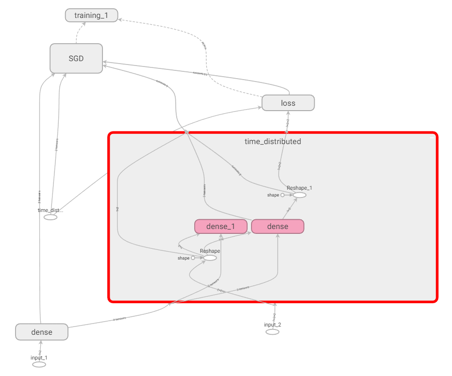

# Silent Bugs in TensorFlow and Keras
This Replication Package is intended for replication of results presented in the paper "Silent Bugs in Deep Learning Frameworks: An Empirical Study of Keras and TensorFlow" accepted for publication by the journal of Empirical Software Engineering in August 2023. It contains the data and artifacts used in the paper.

Our replication package consists of three main folders: Manual_Labelling, Survey, and Artifacts.

## Manual_Labelling
This folder contains, the file **Keras_Bugs_Sheets.xlsx** contains three sheets:
* **Issues Voting**: Contains the 1168 gathered issues. For each of them, we provide title, URL, GitHub labels as well as whether it was accepted by each of the three reviewers along with comments. The total of issues for each of the number of assigned votes is given at the end of the sheet.
* **2 votes bugs**: Contains the list of the 38 two-votes bugs that were discussed by reviewers for eventual acceptation. We reported the title, URL and labels of those issues, as well as the comments of each reviewer for the issue. We highlighted a comment from the reviewer that refused it. The decision after discussion is presented in the "Accepted?" column.
* **Comparison Category**: Contains the list of the 83 issues accepted for the voting round (77 bugs remained at the end). The same information as before is presented. We add the proposition by each reviewer for impact on the user's program (column "Scenario") as well as which part of the API was affected (column "Component"). Final decisions after group discussions are presented in "Final Scenario" and "Final Component", as well as the column "Impact", which determine the threat level according to the scale presented in our paper for each of the issues, and the column "Root Cause", which label the root cause for issue with precise fixing commit following Jia et al. taxonomy. The last column gives information about the URL of the gist for reproduction, the version(s) where the bug happened, the version that fixed the bug and eventually the commit fixing the issue.

## Survey
This folder contains the survey form used for our validation study in the file **Survey_Questionnaire.pdf**. Anonymized information about participants and all their answers to the survey questions are in the file **Responses.csv**. 

## Artifacts
The file **data.csv** contains the list of the 77 issues with the following information: <br />
Issue number; URL; gis; Final Scenario; Final Component 1; Final Component 2; Impact; Root Cause; Buggy Version; Fixed Version; Fixing commit <br />
Since it is formatted as ".csv", it can be extracted easily by external tools.

The subfolder **Bugs_in_JSON** contains the list of the 77 issues (.JSON format) we extracted from the GitHub API. Note that ID of issue does not go from 1 to 77, see the sheet **Comparison Category** in the file **Keras_Bugs_Sheets.xlsx**.

## Example of Issues

The following gives examples of issues leveraged in our study based on the effect category.

### 1. Wrong shape

**This category includes any bug leading to a wrong shape of a tensor in the model without raising an error.**

*Unexpected output shape on custom keras dynamic layer [\#32476](https://github.com/tensorflow/tensorflow/issues/32476)*: In this issue, Keras returns bad shape for the user's custom layer. As one can see below, the output given by Keras differs from the *compute\_output\_shape* function of the custom Layer. We classified this error as **Impact: 2** as, while it returns bad information on the model (the shape), it does not actually alter the way the model should work. If the gist is trivial, it straightforward to envision how this bug could be problematic in a realistic settings; in the case a program of the user would lead to poor accuracy (for instance, because of a bad parametrization), the shape would become the main culprit for the bad result, which would possibly take some time until user finds out that it does not impact its results

```
import tensorflow as tf
import numpy as np

class Example(tf.keras.layers.Layer):
    def __init__(self, **kwargs):
        kwargs["dynamic"] = True
        super(Example, self).__init__(**kwargs)

    def call(self, inputs):
        return inputs

    def compute_output_shape(self, input_shape):
        return [(None, 2)]

inp = tf.keras.layers.Input(batch_shape=(None, 1))
comp = Example()(inp)

model = tf.keras.models.Model(inputs=[inp], outputs=[comp])
model.summary()
```
```
Model: "model"
___________________________________________________________
Layer (type)             Output Shape              Param #
===========================================================
input_1 (InputLayer)         [(None, 1)]               0
___________________________________________________________
example (Example)            [(None, (2,))]            0
===========================================================
Total params: 0
Trainable params: 0
Non-trainable params: 0
```

### 2. Wrong displayed message

**Any bug that shows an information in UI (including console messages) which will deceive the user or affect the user understanding of the ML model belongs to this category.**

*Simple model.evaluate() example floods output with=characters [\#32286](https://github.com/tensorflow/tensorflow/issues/32286)*: In this issue, Keras displays a progress bar that is way too long and which eventually masks part of the UI. The gist used as well as the output UI are shown in the figure. Note that the actual display was drastically shortened as it would not fit in the paper. The progress bar given by Keras is too long between train and test phase. The error was linked to a wrong variable being passed to the iteration routine used in the training/evaluation loop of the API. We classified this bug as as **Impact: 1** as it just affects the UI of the user. This kind of bug is generally harmless, as they do not really modify anything. However, this type of bug can have nasty impact when for instance logging results in a file; it would literally fill the log file with thousands of useless characters. If the bug presented only generate a limited number, a case where the number of returned characters would be very high (or infinite) could potentially result in an out-of-memory issue.

```
import tensorflow as tf

mnist = tf.keras.datasets.fashion_mnist
(training_images, training_labels), (test_images, test_labels) = mnist.load_data()
training_images = training_images / 255.0
test_images = test_images / 255.0
model = tf.keras.models.Sequential([
    tf.keras.layers.Flatten(),
    tf.keras.layers.Dense(128, activation=tf.nn.relu),
    tf.keras.layers.Dense(10, activation=tf.nn.softmax)
    ])
model.compile(optimizer='adam', loss='sparse_categorical_crossentropy', metrics=['accuracy'])
model.fit(training_images, training_labels, epochs=5)

test_loss = model.evaluate(test_images, test_labels)

Output: Train on 60000 samples
[...]
Epoch 5/5
60000/60000 [==============================] - 2s 38us/sample - loss: 0.2980 - accuracy: 0.8903
10000/1 [================================================
... Literally hundreds of thousands of `=` ...
===========================================] - 0s 26us/sample - loss: 0.2803 - accuracy: 0.8673
```

### 3. Wrong save/reload

**In this category, we classify all bugs that change the model, its component or its functionalities either during saving or re-loading. For example, missing a layer after reload or inconsistent accuracy before and after saving.**

*Accuracy is lost after save/load [\#42459](https://github.com/tensorflow/tensorflow/issues/42459)*: The snippet below shows an issue where reloading saved weights leads to a big drop in accuracy. We classified this error as **Impact: 4** as it completely changes the results of the model. If the user would not be careful, simply using the weights without verification, the model would return mostly incorrect predictions. Moreover, it is important to notice that the weights are not necessarily the first place where one would look to track in error, especially in a deeper model, as no error/warnings were thrown. This explains the threats of such errors and highlight the importance of multiple checking procedure when using such frameworks.

```
import tensorflow as tf

model = tf.keras.models.Sequential()
model.add(tf.keras.layers.Dense(units=2, activation='softmax', name='output'))
model.compile(optimizer=tf.keras.optimizers.Adam(lr=10),
              loss='sparse_categorical_crossentropy',
              metrics=['accuracy'])
dummy_data_x = [[0, 0], [1, 0], [0, 1], [1, 1]]
dummy_data_y = [0, 1, 0, 1]
print(model.evaluate(x=dummy_data_x, y=dummy_data_y))
model.fit(x=dummy_data_x, y=dummy_data_y, epochs=10)
print(model.evaluate(x=dummy_data_x, y=dummy_data_y))
model.save('test_model')
model = tf.keras.models.load_model('test_model')
print(model.evaluate(x=dummy_data_x, y=dummy_data_y))
```

```
Output:
Before training:
1/1 [===============] - 0s 0s/step - loss: 0.9013 - accuracy: 0.5000
[0.9013183116912842, 0.5]
After training:
1/1 [===============] - 0s 0s/step - loss: 0.0000e+00 - accuracy: 1.0000
[0.0, 1.0]
After loading:
1/1 [===============] - 0s 1000us/step - loss: 0.0000e+00 - accuracy: 0.5000
[0.0, 0.5]
```

### 4. Wrong parameter settings

**Any bug affecting the expected parameters setting of a function or model's components fall in this category.**

*Passing a Variable as learning\_rate to Adam optimizer does not work as expected [\#31324](https://github.com/tensorflow/tensorflow/issues/31324)*: We refer to this issue below where passing a variable to learning rate and dynamically changing it will not be registered on the learning rate. As one can see from the provided gist and output, even though the learning rate variable got set to 0, the variable of the trainable layer is still being modified. We classified this error as **Impact: 3** as it modified the way of functioning of the network (the learning rate set). In this gist, the learning rate setting is pretty drastic, in practice the user would probably set something akin to a scheduler and reduce the learning rate slowly. Yet, with this issue, it could lead to potential convergence issues. In practice a `LearningRateScheduler` should be define instead (following good practice), so one could argue the mistake is on the user end, but the fact that no warning is thrown, that no documentation explicitly forbid this and that the mechanism is acceptable by the model shows that is more of a potential issue.

```
import tensorflow as tf
print(tf.version.GIT_VERSION, tf.version.VERSION)
import sys
print(sys.version_info)
tf_a = tf.Variable(1.0)
print('Variable tf_a initialized to {}.'.format(tf_a.numpy()))
tf_lr = tf.Variable(0.1, trainable=False)
tf_opt = tf.keras.optimizers.Adam(learning_rate=tf_lr)
@tf.function
def train_step():
    with tf.GradientTape() as tf_tape:
        tf_loss = tf_a**2
    tf_gradients = tf_tape.gradient(tf_loss, [tf_a])
    tf_opt.apply_gradients(zip(tf_gradients, [tf_a]))
print('After one step with learning rate {}... '.format(tf_lr.numpy()), end='')
train_step()
print('Variable tf_a is {}.'.format(tf_a.numpy()))
tf_lr.assign(0.0)
for _ in range(10):
    print('After another step, now with learning rate {}... '.format(tf_lr.numpy()), end='')
    train_step()
    print('Variable tf_a is {}.'.format(tf_a.numpy()))
```

```
Output:
v2.0.0-beta0-16-g1d91213fe7 2.0.0-beta1
sys.version_info(major=3, minor=5, micro=6, releaselevel='final', serial=0)
Variable tf_a initialized to 1.0.
After one step with learning rate 0.10000000149011612... Variable tf_a is 0.8999971747398376.
After another step, now with learning rate 0.0... Variable tf_a is 0.8004083633422852.
After another step, now with learning rate 0.0... Variable tf_a is 0.7015821933746338.
[...]
After another step, now with learning rate 0.0... Variable tf_a is 0.07624538242816925.
After another step, now with learning rate 0.0... Variable tf_a is 0.005127914249897003.
```

### 5. Performance degradation

**Any bug affecting the performance of ML experiments (training or inference) is categorized in this class, *e.g.* memory usage or running time (speed). This category does not include changes in prediction accuracy of the model.**

*TF2.0 - Multiple calls to Keras .fit and .evaluate makes RAM explode and is 25x slower [\#32420](https://github.com/tensorflow/tensorflow/issues/32420)*: In this issue, consecutive calls to either fit() or evaluate() increases the used main memory (RAM) even when calling with the same data. The user complains that such calls take approximately ten times longer than with TF1.x. According to the provided gist, after 3,312 consecutive calls of evaluate() using TF2.0, 1508MB of memory is occupied. Using TF1.x, the memory used is not increased after consecutive calls of evaluate() (staying at 176MB) while the running time was 25 times faster than TF2.0. We evaluated this issue as **Impact: 3** since the bug significantly affects the operation of the model. Although such consecutive calls is not common in developing DL application and the bug does not affect the prediction accuracy, the degraded performance may lead to significant problems during deployment, especially in settings where the systems specification are limited (e.g. on-board system) or when decision speed is important (e.g. autonomous driving system).

```
from memory_profiler import profile
from time import time
import numpy as np
import tensorflow as tf

model = tf.keras.Sequential([tf.keras.layers.Dense(100, activation=tf.nn.softmax)])
model.compile(loss='mse', optimizer='sgd')
@profile
def eval(x, y):
    model.evaluate(x, y)
x = np.random.normal(size=(1,100))
y = np.random.normal(size=(1,100))
for i in range(100000):
    print('iteration', i)
    tic = time()
    eval(x, y)
    print('timeit', time() - tic)

Output: iteration 3312
1/1 [==============================] - 0s 4ms/sample - loss: 1.0205
Filename: reproduce_keras_oom.py

Line     Mem usage    Increment   Line Contents
================================================
     9   1508.3 MiB   1508.3 MiB   @profile
    10                             def eval(x, y):
    11   1508.7 MiB      0.4 MiB       model.evaluate(x, y)

timeit 0.09004998207092285
```

### 6. Wrong structure

**The category covers all bugs that modify the expected structure of a model, in particular how it is handled by the framework.**

*Keras TimeDistributed on a Model creates duplicate layers, and is inconsistent with TimeDistributed on a Layer [\#30486](https://github.com/tensorflow/tensorflow/issues/30486)*: As shownbelow, the user attempts to wrap a model in a TimeDistributed layer but this leads to creation of duplicate nodes in the graph. Following the documentation of the framework, the user ends up with an additional Dense Layer (bottom left in the example below). This additional layer takes redundant memory and is created because the user builds the inner model then rebuilds it again during building the TimeDistributed model. However, the expected behavior for wrapping a model is having a similar graph as it is the case when wrapping a layer. This is a typical example of wrong structure of the model that is silent and the user may not notice it until experiencing a bad accuracy or training issue. We have evaluated this issue as **Impact: 2** as it returns false structure information to the user, which can typically lead to confusion or potentially an error.

```
inner_input = keras.layers.Input((2,))
dense = keras.layers.Dense(2, activation='relu')(inner_input)
inner_model = keras.Model(inputs=inner_input, outputs=dense)
full_input = keras.layers.Input((2,2))
td_2 = keras.layers.TimeDistributed(inner_model)(full_input)
model = keras.models.Model(full_input, td_2)
model.compile('SGD', 'mse')
```



### 7. Wrong calculation

**All bugs modifying the normal way of computation that are not classified in other categories will be classified in this type, like wrong calculation of gradients.**

*Keras fails to account for smaller last batch in loss metric calculation [\#38596](https://github.com/tensorflow/tensorflow/issues/38596)*: In this issue the evaluate() function computes the mean loss over all batches in an epoch incorrectly when the dataset size is not evenly divisible by the batch size. This happens for both training and validation loss. Actually, the bug affects the reported epoch loss, but **not** the training loss used for computing gradient updates. In the provided gist, there are 3 samples in the dataset, and the batch size is 2. So, there are 2 batches of size 2 and 1. If the first batch has mean loss of 10 and the second batch has mean loss of 9, then the mean loss over the entire dataset is incorrectly computed as (10 + 9) / 2 = 9.5. We evaluated this bug as **Impact: 2** since the model's information is affected but not its functionality. However, the correct mean loss over the dataset should be a weighted mean of the batch losses, where the weights are given by each batch size. Thus, the correct mean loss should be (10*2 + 9*1) / (2 + 1) = 9.66.

```
import tensorflow as tf

X = tf.constant([[1], [2], [3]], dtype=tf.float32)
y = tf.constant([[5], [4], [6]], dtype=tf.float32)
model = tf.keras.Sequential([
    tf.keras.layers.Dense(1, input_dim=1, kernel_initializer='ones', bias_initializer='zeros')])
model.compile(optimizer='sgd', loss='mean_squared_error')
def mse(y, y_pred):
    assert len(y) == len(y_pred)
    return sum((y - y_pred)**2)/len(y)
print('model.evaluate():')
print('- batch_size=1:', model.evaluate(X, y, batch_size=1, verbose=0))
print('- batch_size=2:', model.evaluate(X, y, batch_size=2, verbose=0))
print('- batch_size=3:', model.evaluate(X, y, batch_size=3, verbose=0))
print()
print((mse(X[:-1], y[:-1]) + mse(X[-1], y[-1]))/2)

Output:
model.evaluate():
- batch_size=1: 9.666666984558105
- batch_size=2: 9.5
- batch_size=3: 9.666666984558105

tf.Tensor([9.5], shape=(1,), dtype=float32)
```
